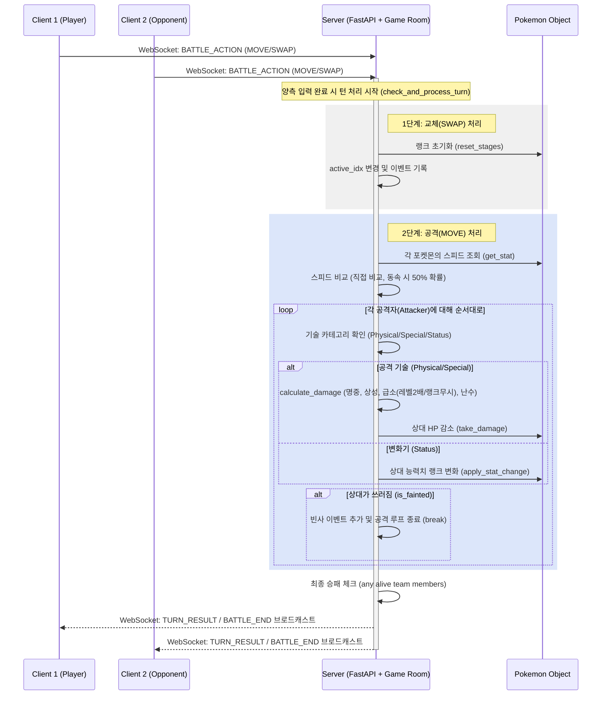
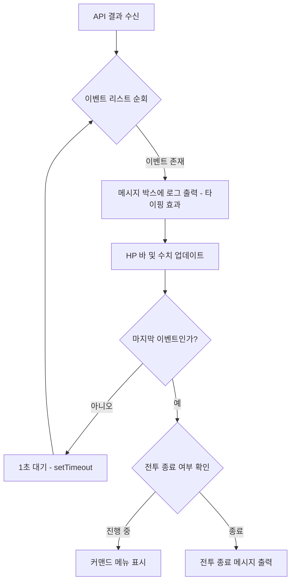
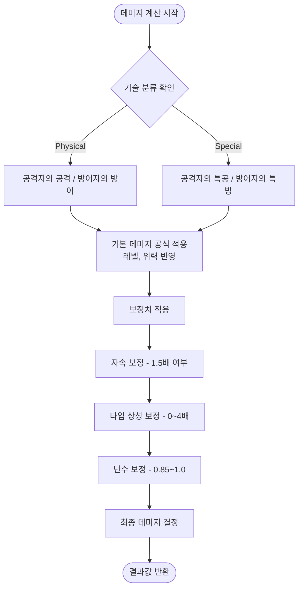

# 포켓몬 전투 로직 흐름도 (Mermaid Diagram)

현재 구현된 선후공 및 데미지/상태 변화 처리 로직의 흐름을 나타낸 다이어그램입니다.

## 1. 전체 전투 턴 흐름 (백엔드 로직)

```mermaid
sequenceDiagram
    participant C1 as Client 1 (Player)
    participant C2 as Client 2 (Opponent)
    participant S as Server (FastAPI + Game Room)
    participant P as Pokemon Object

    C1->>S: WebSocket: BATTLE_ACTION (MOVE/SWAP)
    C2->>S: WebSocket: BATTLE_ACTION (MOVE/SWAP)
    
    activate S
    Note over S: 양측 입력 완료 시 턴 처리 시작 (check_and_process_turn)
    
    rect rgb(240, 240, 240)
    Note right of S: 1단계: 교체(SWAP) 처리
    S->>P: 랭크 초기화 (reset_stages)
    S->>S: active_idx 변경 및 이벤트 기록
    end

    rect rgb(220, 230, 250)
    Note right of S: 2단계: 공격(MOVE) 처리
    S->>P: 각 포켓몬의 스피드 조회 (get_stat)
    S->>S: 스피드 비교 (직접 비교, 동속 시 50% 확률)
    
    loop 각 공격자(Attacker)에 대해 순서대로
        S->>S: 기술 카테고리 확인 (Physical/Special/Status)
        
        alt 공격 기술 (Physical/Special)
            S->>S: calculate_damage (명중, 상성, 급소(레벨2배/랭크무시), 난수)
            S->>P: 상대 HP 감소 (take_damage)
        else 변화기 (Status)
            S->>P: 상대 능력치 랭크 변화 (apply_stat_change)
        end
        
        alt 상대가 쓰러짐 (is_fainted)
            S->>S: 빈사 이벤트 추가 및 공격 루프 종료 (break)
        end
    end
    end

    S->>S: 최종 승패 체크 (any alive team members)
    S-->>C1: WebSocket: TURN_RESULT / BATTLE_END 브로드캐스트
    S-->>C2: WebSocket: TURN_RESULT / BATTLE_END 브로드캐스트
    deactivate S
```

## 2. 프론트엔드 연출 흐름

```mermaid
graph TD
    A[API 결과 수신] --> B{이벤트 리스트 순회}
    B -- "이벤트 존재" --> C[메시지 박스에 로그 출력 - 타이핑 효과]
    C --> D[HP 바 및 수치 업데이트]
    D --> E{마지막 이벤트인가?}
    E -- "아니오" --> F[1초 대기 - setTimeout]
    F --> B
    E -- "예" --> G{전투 종료 여부 확인}
    G -- "진행 중" --> H[커맨드 메뉴 표시]
    G -- "종료" --> I[전투 종료 메시지 출력]
```

## 3. 데미지 계산 상세 과정 (Special/Physical)

```mermaid
flowchart TD
    Start([데미지 계산 시작]) --> Cat{기술 분류 확인}
    Cat -- Physical --> AtkDfn[공격자의 공격 / 방어자의 방어]
    Cat -- Special --> SpAtkDfn[공격자의 특공 / 방어자의 특방]
    
    AtkDfn & SpAtkDfn --> Base[기본 데미지 공식 적용<br/>레벨, 위력 반영]
    Base --> Mod[보정치 적용]
    
    Mod --> STAB[자속 보정 - 1.5배 여부]
    STAB --> Type[타입 상성 보정 - 0~4배]
    Type --> Rand[난수 보정 - 0.85~1.0]
    
    Rand --> Final[최종 데미지 결정]
    Final --> End([결과값 반환])
```
